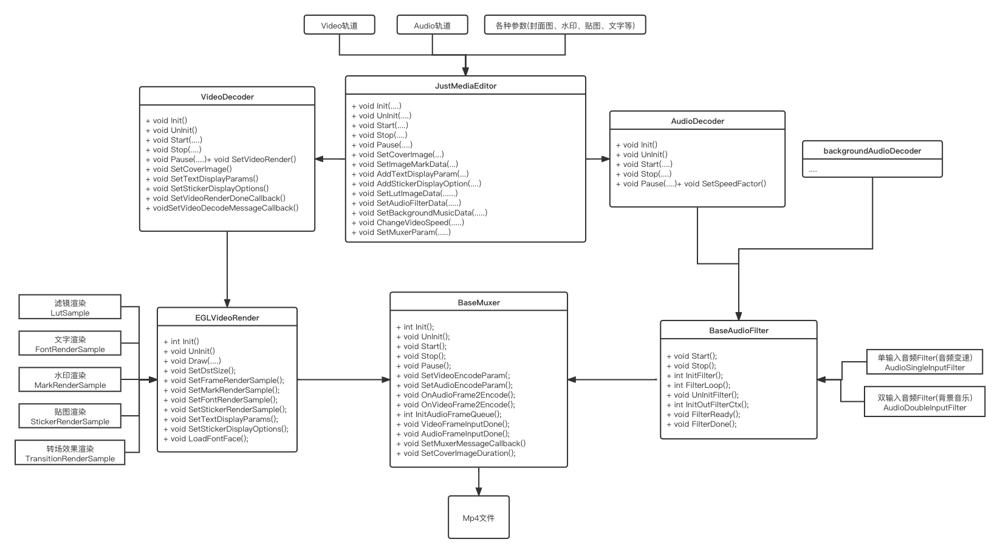

# JustMediaEditor
一款视频编辑工具，主要实现了以下功能

编辑方式|封面图|水印图|滤镜|速度调整|背景音乐|贴图|文字|图片转场
:--:|:--:|:--:|:--:|:--:|:--:|:--:|:--:|:--:
视频编辑|√|√|√|√|√|√|√|X
多图合成视频|√|√|X|X|√|√|√|√

Ps: 更多功能添加中..


## 流程图


### API
```
视频编辑：
JustMediaEditor.startEditor(context: Context, editorParam: VideoEditorParam, eventListener: IEditEventListener? = null)
JustMediaEditor.stopEditor()
JustMediaEditor.registerEditEventListener(eventListener: IEditEventListener?)

多图合成视频
JustPic2VideoEditor.startEditor(context: Context, editorParam: Pic2VideoEditorParam, editEventListener: IEditEventListener? = null)
JustPic2VideoEditor.stopEditor()
JustPic2VideoEditor.registerEditorEventListener(editEventListener: IEditEventListener?)
```
### 参数
```
interface IEditEventListener {
    fun onEditEvent(messageType: MediaEditorMessageType?, messageValue: Float)
}

enum MediaEditorMessageType
    TYPE_ERROR(-1),                                 //错误
    TYPE_DURATION(0),                               //目标视频总时长
    TYPE_CURRENT_TIME(1),                           //当前已编辑完成时长
    TYPE_DONE(2);                                   //编辑已完成

VideoEditorParam
    videoUrl: String?,                              //Video轨道资源path绝对路径
    backgroundMusicUrl: String?,                    //背景音乐音轨资源path绝对路径
    lutFilterBitmap: Bitmap?,                       //LUT滤镜资源图片
    speedOption: SpeedOption?,                      //速度参数
    speedWithAudio: Boolean,                        //是否同步改变音频速度
    width: Int?,                                    //生成的Video宽
    height: Int?,                                   //生成的Video高
    bitRate: Long?,                                 //生成的Video码率
    audioUrl: String?,                              //Audio轨道资源path绝对路径
    dstUrl: String,                                 //生成文件路径
    coverImage: Bitmap?,                            //封面图资源Bitmap
    markImageOption: MarkImageOption?,              //水印资源配置
    stickerOptionList: List<StickerImageOption>?,   //贴图资源配置list
    textOptionList: List<FontTextOption>?           //文字资源配置list
    
Pic2VideoEditorParam
    multiPicPath: List<String>?,                    //合成视频的图片资源path绝对路径list
    transitionTypeGlsl: String?,                    //图片转场glsl代码(fshader)
    fps: Int?,                                      //生成的Video帧率
    width: Int?,                                    //生成的Video宽
    height: Int?,                                   //生成的Video高
    bitRate: Long?,                                 //生成的Video码率
    audioUrl: String?,                              //Audio轨道资源path绝对路径
    dstUrl: String,                                 //生成Video路径
    coverImage: Bitmap?,                            //封面图资源Bitmap
    markImageOption: MarkImageOption?,              //水印资源配置
    stickerOptionList: List<StickerImageOption>?,   //贴图资源配置list
    textOptionList: List<FontTextOption>?           //文字资源配置list
    
enum SpeedOption --> 速度参数
    SPEED_1_2("0.5", 0.5F),                         //0.5倍播放速度
    SPEED_1_1("1", 1F),                             //1倍播放速度
    SPEED_2_3("1.5", 1.5F),                         //1.5倍播放速度
    SPEED_2_1("2", 2F),                             //2倍播放速度
    SPEED_4_1("4", 4F);                             //4倍播放速度
    
MarkImageOption  --> 水印资源配置
    bitmap: Bitmap,                                //水印图片Bitmap
    positionX: Float,                              //水印显示位置 X(0 - 1)
    positionY: Float,                              //水印显示位置 Y(0 - 1)
    
StickerImageOption  --> 贴图资源配置
    bitmap: Bitmap,                                //贴图图片Bitmap
    positionX: Float,                              //贴图显示位置 X(-1 - 1)
    positionY: Float,                              //贴图显示位置 Y(-1 - 1)
    durationStart: Float,                          //贴图显示开始时间(s)
    durationEnd: Float                             //贴图显示结束时间(s)
    
FontTextOption  --> 文字资源配置
    text: String,                                  //要显示的文字
    fontPath: String,                              //文字字体绝对路径
    positionX: Float,                              //文字显示位置 X(-1 - 1)
    positionY: Float,                              //文字显示位置 Y(-1 - 1)
    durationStart: Float,                          //文字显示开始时间(s)
    durationEnd: Float,                            //文字显示结束时间(s)
    colorR: Float,                                 //文字显示颜色R分量(0-1)
    colorG: Float,                                 //文字显示颜色G分量(0-1)
    colorB: Float                                  //文字显示颜色B分量(0-1)
```

使用示例(具体示例请下载工程，查看示例)
```
  //开始视频编辑
  val vEditorParamBuilder = VideoEditorParam.Builder()
  vEditorParamBuilder
      .setVideoUrl(tvVideoPath.getTextString())
      .setBackgroundMusicUrl(tvBackgroundPath.getTextString())
      .setLutFilterBitmap(CommonUtil.getLutBitmap(this@JustMediaEditorDemoActivity,
          LutFilter.fromName(spinnerFilter.selectedItem as String)?.lutValue))
      .setSpeedOption(SpeedOption.fromName(spinnerSpeed.selectedItem as String))
      .setSpeedWithAudio(cbWithAudio.isChecked)
      .setWidth(resolutionOption?.width)
      .setHeight(resolutionOption?.height)
      .setBitrate(resolutionOption?.bitRate)
      .setAudioUrl(tvAudioPath.getTextString())
      .setDstUrl(CommonUtil.generateDstUrl())
      .setCoverImage(coverImageBitmap)
      .setStickerImageOptionList(stickerOptionList)
      .setFontTextOptionList(textOptionList)
      
  if (markImageBitmap != null) {
      vEditorParamBuilder.setMarkImageOption(MarkImageOption(
          markImageBitmap!!,
          etMarkImageX.getTextString()?.toFloat() ?: 1F,
          etMarkImageY.getTextString()?.toFloat() ?: 1F))
  }

  JustMediaEditor.startEditor(
      this@JustMediaEditorDemoActivity, 
      vEditorParamBuilder.build(), 
      object : IEditEventListener {
          override fun onEditEvent(
              messageType: MediaEditorMessageType?,
              messageValue: Float
          ) {
              TODO("Not yet implemented")
          }
      })
    
    
  //开始图片合成视频
  val pEditorParamBuilder = Pic2VideoEditorParam.Builder()
  pEditorParamBuilder
      .setMultiPicPath(picturePathList)
      .setTransitionTypeGlsl(CommonUtil.getTransitionFShaderStr(this@JustMediaEditorDemoActivity,
          TransitionType.fromName(spinnerTransitionType.selectedItem as String)?.value))
      .setFps(FrameRateOption.fromName(spinnerFrameRate.selectedItem as String)?.fps)
      .setWidth(resolutionOption?.width)
      .setHeight(resolutionOption?.height)
      .setBitrate(resolutionOption?.bitRate)
      .setAudioUrl(tvAudioPath.getTextString())
      .setDstUrl(CommonUtil.generateDstUrl())
      .setCoverImage(coverImageBitmap)

      .setStickerImageOptionList(stickerOptionList)
      .setFontTextOptionList(textOptionList)
      
  if (markImageBitmap != null) {
      pEditorParamBuilder.setMarkImageOption(
          MarkImageOption(markImageBitmap!!,
              etMarkImageX.getTextString()?.toFloat() ?: 1F,
              etMarkImageY.getTextString()?.toFloat() ?: 1F))
  }
  
  JustPic2VideoEditor.startEditor(
      this@JustMediaEditorDemoActivity,
       pEditorParamBuilder.build(), 
       object : IEditEventListener {
      override fun onEditEvent(
          messageType: MediaEditorMessageType?,
          messageValue: Float
      ) {
          TODO("Not yet implemented")
      }
  })
```
